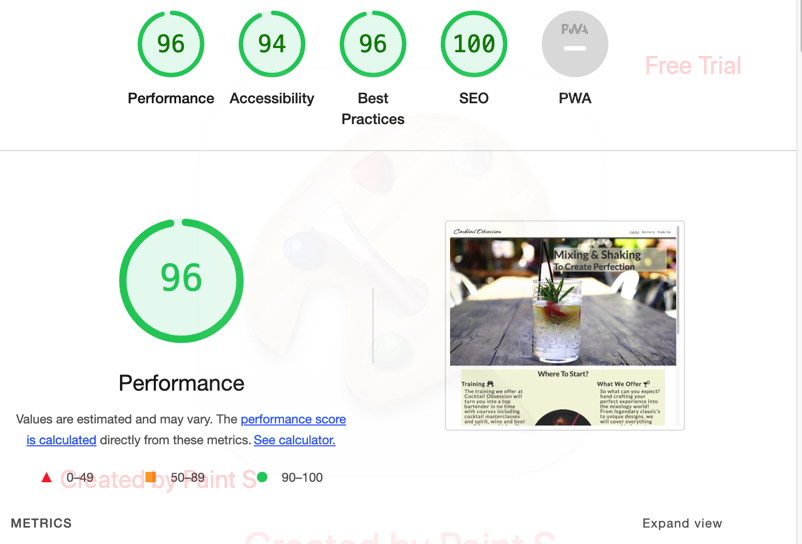

# Cocktail Obsession

The Cocktail Obsession website is a chance for adults to gain knowledge, wether it is high to no experience, in making and preparing drinks for any occasion.

People who use the website will be able to find information on recipes and course details, including cocktail masterclasses and specific type alcohol training - spirits, wine and beer. Weekly emails will be sent out including: recipe of the week, bar equipment guides, glassware and much more. This site is targeted for anyone who is interested in the drinks industry, if youre just a home bartender or staff working those busy friday and saturday nights, we target all audiences to take you to the next level.

# Features

- Navigation

  - At the top of the page on the left the heading of the website: Cocktail Obsession links to the top of the page and back to the home page from any other pages.
  - At the top of the page on the right is the remaining links to other pages: Gallery and Sign UP, which will take you to different pages respectively.
  - The heading is clear and spaced out to make navigating around the website easy and accessible.

- The Header

  - The heading is in a detailed in an elequant art-type font to associate with cocktail making.
  - The header has a video of a cocktail being poured to indicate what the objective of the website is.
  - The section has a graceful quote that presesnts users what the aim is.
 

- Where to start section

  - This section gives details on what we offer the members who sign up.
  - This shows benefits and an inside of what users will and can achieve.
  - The section is laid out to be easily read and on a beige background to match with the rest of the site with an inticing picture to attract users.
  

- Recipe Section

  - This section shows a few cocktails with hoverable dropdowns to display the recipe.
  - This section gives the users a chance to try the services before signing up.

- The Gallery

  - This page shows the user examples of what can be achieved with courses being offered.
  - This page shows clear and well detailed. glamerous cocktails to encourage sign up.

- Sign Up Page

  - The sign up page has a form to collect details so they can sign up.
  - The form collects: first name, last name, email address and prefernce of what their interest is for targeted emails; cocktail masterclasses, weekly recipe's or both.
  - The sign up page is valuable to the user as it allows them to join and gain services.

- The Footer

  - The footer provides links to the websites social media.
  - The links allow users to see more that the website has to offer with more pictures and examples.

# Testing

- I tested that the website works in different browsers: Chrome, Safari
- I tested that the website is responsize, has a good look and is easy readable on all devices using the devtools device.
- I have confirmed that the navigation, home page and sign up page are easily readable.
- I have tested the form page works: requires entries in all fields and requires email in email field and submit button works

## Bugs

- Once validating i discovered some errors and warnings such as this

- removing the space and replacing it with %20 fixed this
- Some sections were missing heading's so i added where needed and hid them using a hidden heading class in css
- Tge recipe section images had the height and width in the index file, moving this to the css fixed the issue.

## Validator Testing

- HTML
  - No errors returned when passing through the official W3C validator.

- CSS
  - No errors returned when passing through the official W3C CSS validator.

  

  ## Unfixed Bugs

  - There are no unfixed bugs.

  # Deployment

  - The site was deployed to GitHub pages. The steps to deploy are as followed:
    - In the GitHub repository, navigate to the settings tab.
    - From the source section drop-down menu, select the Master Branch.
    - Once the Master Branch has been selected, the page provided the link to the completed website.
  
  The link to the website is as followed: [Cocktail Obsession](https://tobycoleman3.github.io/cocktail-obsession/)

  # Credits

  ## Content 

  - The code to make the social links were taken from the CI [Love Running](https://github.com/Code-Institute-Org/love-running-2.0) project
  
  ## Media 

  - The images and video on the main page, gallery and sign up page were taken from [Pexels](https://www.pexels.com/)